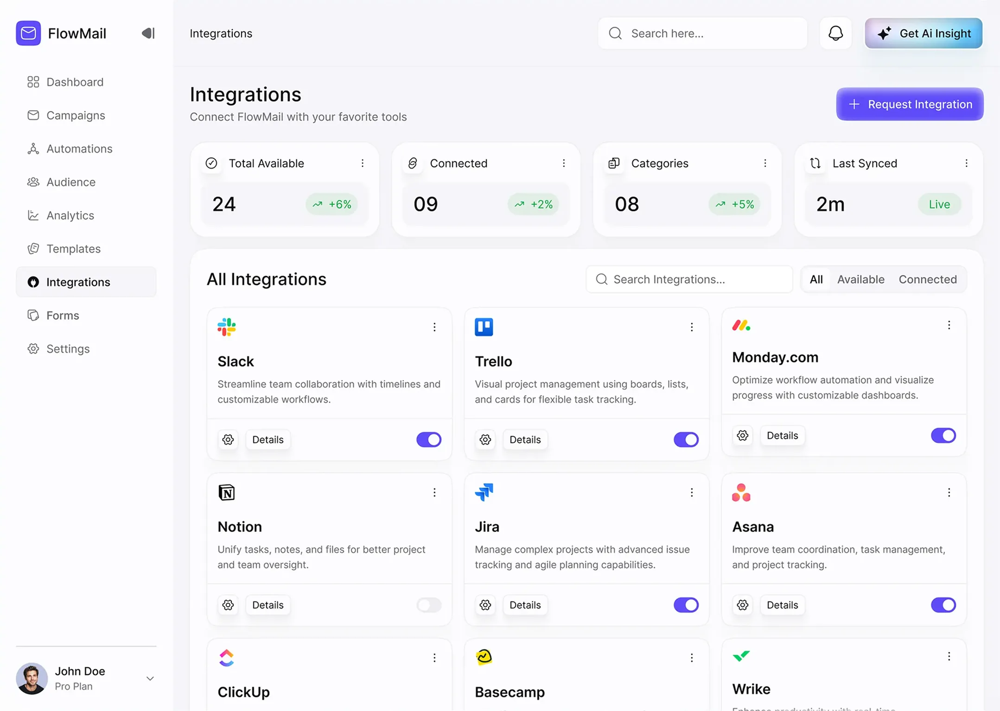
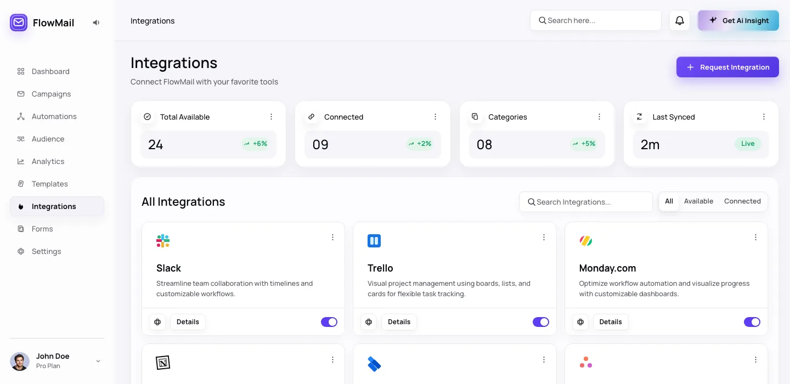

# Image to Webpage

将截图、App 快照、网页截图或视觉稿还原为可运行、可维护的 React 网页。

## 核心能力

输入一张截图后，项目会围绕三个阶段组织还原工作：设计令牌提取、UI DSL 提取、网页渲染实现。

设计令牌用于记录颜色、字体、圆角、阴影、间距、边框、层级和关键视觉资产策略，避免直接凭感觉写样式。

UI DSL 用于描述页面结构、布局关系、持久导航、滚动区域、组件层级、图片层叠关系，以及需要忽略的展示外壳。

渲染阶段会把设计令牌和 UI DSL 落地为 React、CSS 和项目可运行页面，并通过构建日志、产物检查和非浏览器校验确认结果没有明显缺失。

## 适合场景

这个项目适合用来把产品截图、后台界面、移动端 App 页面、落地页局部、卡片式界面或设计探索稿还原成真实网页。

如果截图中存在手机壳、浏览器壳、展示画布、外层圆角样机、iOS Home Indicator、Android 导航条等展示或系统外壳，默认应把它们识别为非产品 UI，而不是还原成页面内容。

## 技术栈与项目结构

当前项目基于 Vite + React + Tailwind CSS 构建，提供开发服务、生产构建和本地预览脚本。

示例页面、资源和产物都放在 `src/pages/<page-name>/` 下，相关的 design tokens、UI DSL 和渲染记录保存在对应的 `artifacts/` 目录中，例如：

- `src/pages/flowmail-gpt-5.5/`
- `src/pages/applestore-gpt-5.5/`
- `src/pages/evilrabbit-gpt-5.5/`

本项目在测试过程中，全程使用 codex 以及 gpt-5.5/5.4/5.3 来测试，不保证其他 IDE 以及模型的效果。并且模型应支持图片输入，最好还具备生图能力（本文使用 codex 的 image gen skill），才能取得最佳效果。

```bash
npm install
npm run dev
npm run build
npm run preview
```

## 快速开始

### 1. 安装 Skill

使用以下命令，在任意 IDE 中安装或更新 Image-to-Webpage Skill。

```markdown
从 https://github.com/Jeeemmy/image-to-webpage/blob/main/skills/image-to-webpage/SKILL.md 安装或更新该 skill。
```

### 2. 开始还原

直接发送截图，并让 AI 开始还原。

```markdown
<附件：截图>
还原截图为页面
```

## 展示样例

以下示例全部是首次生成的结果，没有做额外调整。

### 案例 1：常规页面 Regular Dashboard

| 原图 Original | GPT-5.5 |
|---|---|
|  |  |
