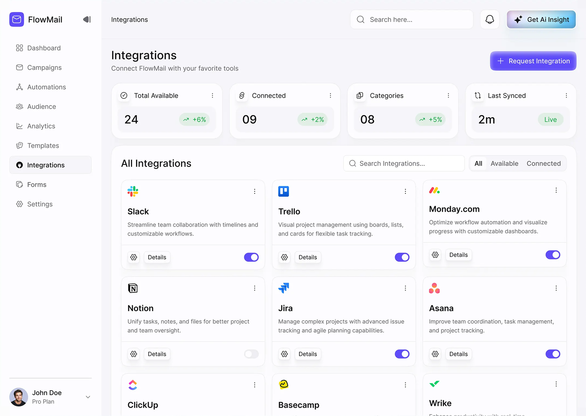
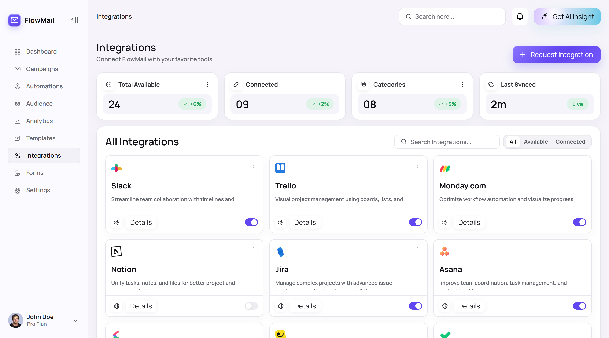
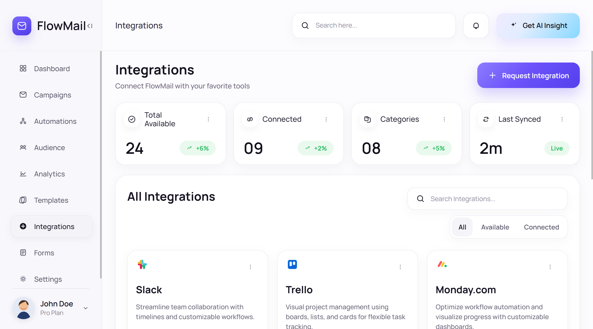
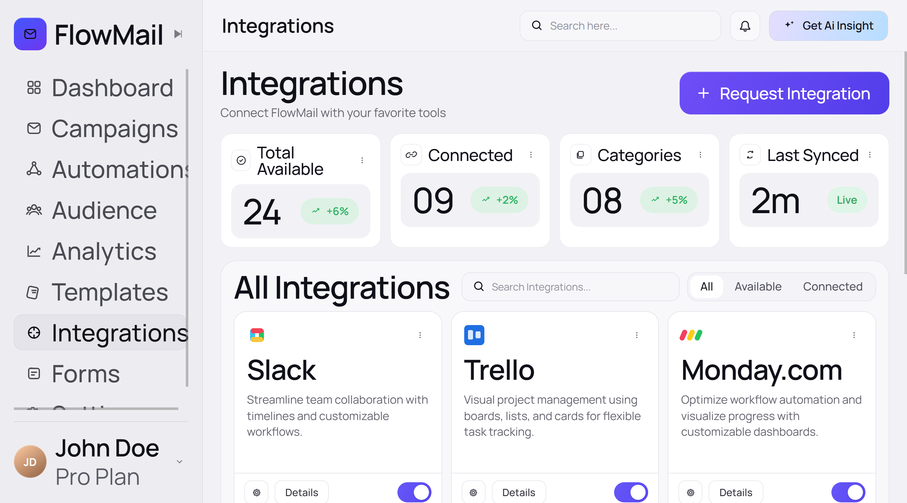

# Image to Webpage

将截图、App 快照、网页截图或视觉稿还原为可运行、可维护的 React 网页。

Convert screenshots, app snapshots, webpage screenshots, or visual mockups into runnable and maintainable React web pages.

## 核心能力 Core Capability

输入一张截图后，项目会围绕三个阶段组织还原工作：设计令牌提取、UI DSL 提取、网页渲染实现。

After a screenshot is provided, the project organizes reconstruction around three stages: design token extraction, UI DSL extraction, and webpage rendering implementation.

设计令牌用于记录颜色、字体、圆角、阴影、间距、边框、层级和关键视觉资产策略，避免直接凭感觉写样式。

Design tokens record colors, typography, corner radii, shadows, spacing, borders, hierarchy, and important visual asset strategies, so styles are not written from guesswork alone.

UI DSL 用于描述页面结构、布局关系、持久导航、滚动区域、组件层级、图片层叠关系等。

The UI DSL describes page structure, layout relationships, persistent navigation, scroll regions, component hierarchy, image layering, etc.

渲染阶段会把设计令牌和 UI DSL 落地为 React、CSS 和项目可运行页面，并通过构建日志、产物检查和非浏览器校验确认结果没有明显缺失。

The rendering stage turns the design tokens and UI DSL into React, CSS, and runnable project pages, then uses build logs, artifact checks, and non-browser validation to confirm that no obvious pieces are missing.

## 适合场景 Use Cases

这个项目适合用来把产品截图、后台界面、移动端 App 页面、落地页局部、卡片式界面或设计探索稿还原成真实网页。

This project is suitable for turning product screenshots, dashboard interfaces, mobile app screens, landing page sections, card-based interfaces, or design explorations into real web pages.

如果截图中存在手机壳、浏览器壳、展示画布等展示或系统外壳，默认识别为非产品 UI，而不是还原成页面内容。

If a screenshot includes phone frames, browser frames, presentation canvases, outer rounded mockups, or other presentation/system chrome, they will be identified as non-product UI instead of being reconstructed as page content.

## 快速开始 Getting Started

当前工程不单只有 skill 内容，还包含了一个简单的多页面生成演示框架和许多还原的实例。如果只是需要 skill，则直接查看核心技能部分。

The current project scripts cover the development server, production build, and local preview. The full project includes many screenshot reconstruction examples; If you only need the skill, see Core Skill part.

本项目在测试过程中，全程使用 codex 以及 gpt-5.5/5.4/5.3 来测试，不保证其他 IDE 以及模型的效果。并且模型应支持图片输入，甚至具备生图能力（本文使用 codex 的 image gen skill），才能取得最佳效果。

During testing, this project was tested with codex and gpt-5.5/5.4/5.3 throughout. Results in other IDEs or with other models are not guaranteed. For best results, the model should support image input and ideally image generation capabilities; this document uses codex's image gen skill.

完整安装，拉取本项目之后，在项目内执行 npm install，npm run dev。

##  核心技能 Core Skill

### 1. 安装技能 Install Skill

使用以下命令，在任意 IDE 中安装或更新 Image-to-webpage Skill。

Use the following instruction to install or upgrade the Image-to-webpage Skill in any IDE.

```markdown
Install or Upgrade the skill from https://github.com/Jeeemmy/image-to-webpage/blob/main/skills/image-to-webpage/SKILL.md.
```

### 2. 开始还原 start reconstruct

直接发截图，并让 AI 开始还原

```markdown
<附件：截图>
还原截图为页面
```

Send the screenshot directly and ask the AI to start reconstructing it.

```markdown
<Attachment: screenshot>
Recreate the screenshot as a page.
```

## 展示模板 Showcase

### Case 1：常规后台 Regular Dashboard

最常规的后台，比较常规的设计，几乎不用图片素材作为内容填充。

| 原图 Original | GPT-5.5 |
|---|---|
|  |  |

| GPT-5.4 | GPT-5.3-codex | 
|---|---|
|  |  |
